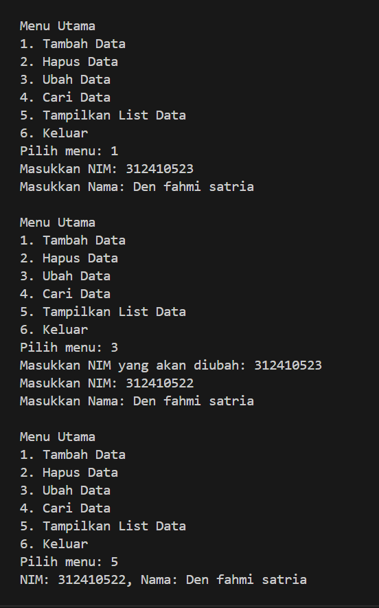

# Project-OOP-Den
## struktur dari direktori <p>
 <p>
## Berikut adalah program python <p>
```
 class Mahasiswa:
    def __init__(self, nim, nama):
        self.nim = nim
        self.nama = nama

class DataMahasiswa:
    def __init__(self):
        self.data = []

    def tambah_data(self, mahasiswa):
        self.data.append(mahasiswa)

    def hapus_data(self, nim):
        self.data = [m for m in self.data if m.nim != nim]

    def ubah_data(self, nim, mahasiswa_baru):
        for idx, mahasiswa in enumerate(self.data):
            if mahasiswa.nim == nim:
                self.data[idx] = mahasiswa_baru

    def cari_data(self, nim):
        for mahasiswa in self.data:
            if mahasiswa.nim == nim:
                return mahasiswa
        return None

class InputForm:
    def __init__(self):
        pass

    def input_data(self):
        nim = input("Masukkan NIM: ")
        nama = input("Masukkan Nama: ")
        return nim, nama

class ViewMahasiswa:
    def __init__(self):
        self.data_mahasiswa = DataMahasiswa()

    def tampilkan_list(self):
        for mahasiswa in self.data_mahasiswa.data:
            print(f"NIM: {mahasiswa.nim}, Nama: {mahasiswa.nama}")

    def tampilkan_detail(self, nim):
        mahasiswa = self.data_mahasiswa.cari_data(nim)
        if mahasiswa:
            print(f"Detail Mahasiswa - NIM: {mahasiswa.nim}, Nama: {mahasiswa.nama}")
        else:
            print(f"Mahasiswa dengan NIM {nim} tidak ditemukan.")

def main():
    view_mahasiswa = ViewMahasiswa()
    input_form = InputForm()

    while True:
        print("\nMenu Utama")
        print("1. Tambah Data")
        print("2. Hapus Data")
        print("3. Ubah Data")
        print("4. Cari Data")
        print("5. Tampilkan List Data")
        print("6. Keluar")
        pilihan = input("Pilih menu: ")

        if pilihan == "1":
            nim, nama = input_form.input_data()
            mahasiswa = Mahasiswa(nim, nama)
            view_mahasiswa.data_mahasiswa.tambah_data(mahasiswa)
        elif pilihan == "2":
            nim = input("Masukkan NIM yang akan dihapus: ")
            view_mahasiswa.data_mahasiswa.hapus_data(nim)
        elif pilihan == "3":
            nim = input("Masukkan NIM yang akan diubah: ")
            mahasiswa_baru = Mahasiswa(*input_form.input_data())
            view_mahasiswa.data_mahasiswa.ubah_data(nim, mahasiswa_baru)
        elif pilihan == "4":
            nim = input("Masukkan NIM yang dicari: ")
            view_mahasiswa.tampilkan_detail(nim)
        elif pilihan == "5":
            view_mahasiswa.tampilkan_list()
        elif pilihan == "6":
            print("Terima kasih!")
            break
        else:
            print("Pilihan tidak valid!")

if __name__ == "__main__":
    main()
```
## hasil eksekusi


